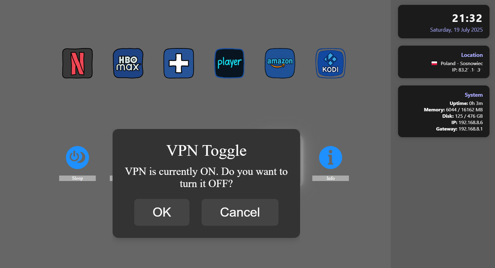

# HTPC Kiosk

HTPC Kiosk is a small Electron-based application designed to launch media services and system commands from a simple, fullscreen kiosk environment. It's ideal for a dedicated home theatre PC, providing easy access to streaming sites and essential controls with a remote-friendly interface.

## Overview

The application presents a customizable grid of applications and commands. A persistent sidebar displays system status, network information, and geolocation data.

| Main Interface | Application Grid |
| :---: | :---: |
|  |  |

| VPN Toggling | Network Configuration |
| :---: | :---: |
|  |  |


## Features

-   **Customizable Grid**: Easily configure the grid of applications and shortcuts by editing a single JSON file.
-   **Web App Kiosk**: Launch any web application (like Netflix, YouTube, etc.) in a dedicated, fullscreen Microsoft Edge kiosk session.
-   **System Commands**: Access essential system functions like Sleep, Shutdown, Reboot, and launch local applications like Kodi directly from the interface.
-   **Network Management**: Includes a built-in configuration screen to change IP settings and a one-click VPN toggle for predefined network profiles.
-   **Status Dashboard**: The sidebar provides at-a-glance information about system uptime, memory usage, disk space, IP address, and geolocation.
-   **Remote-Friendly Navigation**: Full keyboard and remote control navigation for all interface elements.

## Setup and Installation

### Prerequisites

1.  **Node.js**: Install a current Node.js release (v20 LTS or later is recommended) from https://nodejs.org/.
2.  **Sysinternals PsShutdown**: For the 'Sleep' function to work correctly, download the Sysinternals Suite and place `psshutdown.exe` inside the `tools` directory.

### Directory Structure

It is highly recommended to clone or place the repository in `C:\HTPC\htpc-kiosk`. The application is configured to work best from this path.

```
C:\HTPC\htpc-kiosk\
├── config\         # Application grid (matrix.json) and icons
├── dist\           # Build output goes here
├── doc\            # Screenshots
├── scripts\        # PowerShell scripts for network management
├── startpage\      # HTML/CSS/JS for the frontend
├── tools\          # External tools like psshutdown.exe
├── user_data\      # User session data (cache, cookies)
└── main.js         # Main Electron process
```

The application stores its user data (cache, cookies) in `C:\HTPC\htpc-kiosk\user_data`.

### Installation

Open a terminal or PowerShell in the project directory and install the dependencies:

```powershell
npm install
```

## Usage

### Running in Development

To start the application for development, which enables live reloading and console logging:

```powershell
npx electron . --enable-logging
```

To start with a clean slate, you can pass the `--clear-cache` flag:

```powershell
npx electron . --enable-logging --clear-cache
```

Helper scripts (`htpc.bat`, `htpc.ps1`) are also available for convenience.

### Building the Distribution

To package the application for distribution (e.g., to run without the source code), use the `electron-builder` script defined in `package.json`:

```powershell
npm run dist
```

The output will be created in the `dist` folder. The runnable application can be found in `dist\win-unpacked`.

## Configuration

### Customizing the Application Grid (`matrix.json`)

The main grid of buttons is configured in `config/matrix.json`. You can add, remove, or modify entries in this file to customize the kiosk interface. The application needs to be restarted for changes to take effect.

Each entry in the JSON array is an object with four properties:

-   `icon`: The filename of the icon to display. The file must be placed in the `config/icons/` directory.
-   `label`: The text label displayed below the icon.
-   `type`: Determines the button's behavior. Can be either `"link"` or `"command"`.
-   `action`: The target for the action. Its meaning depends on the `type`.
-   `vpn` (optional, link only): Set to `"on"` or `"off"` to require a specific VPN
    state before opening the link.

The grid layout is fixed at 6 columns by 4 rows (24 cells). The `matrix.json`
file must therefore contain exactly 24 entries. Any entry that is missing
required fields is replaced with an empty placeholder when the application
loads.

#### Type: `link`

A `link` type opens the specified URL in a new, fullscreen Microsoft Edge kiosk window. This is ideal for web-based streaming services.

**Example:**
```json
{
  "icon": "netflix2.png",
  "label": "Netflix",
  "type": "link",
  "action": "https://www.netflix.com/",
  "vpn": "on"
}
```
If the current VPN status doesn't match the value specified in `vpn`, the user
is asked to confirm before the link is opened.

#### Type: `command`

A `command` type executes a built-in system function.

**Example:**
```json
{
  "icon": "system-sleep.png",
  "label": "Sleep",
  "type": "command",
  "action": "sleep"
}
```

The following `action` values are supported for `command` types:
-   `sleep`: Puts the computer to sleep (requires `psshutdown.exe`).
-   `shutdown`: Shuts the computer down.
-   `reboot`: Restarts the computer.
-   `kodi`: Launches the Kodi application (assumes it's installed at `C:\Program Files\Kodi\kodi.exe`).
-   `VPN`: Toggles between pre-configured VPN network settings.
-   `info`: Displays a detailed system information dialog.
-   `setup`: Opens the network configuration dialog.

### Network Configuration Dialog

Selecting the **Config** (`setup`) command opens the network configuration screen (`startpage/config.html`). This dialog allows the user to view and edit the primary network adapter's IP address, gateway, and DNS settings. Applying changes requires administrator rights, and a `sudo` prompt will appear. The underlying logic is handled by PowerShell scripts located in the `scripts` directory.
